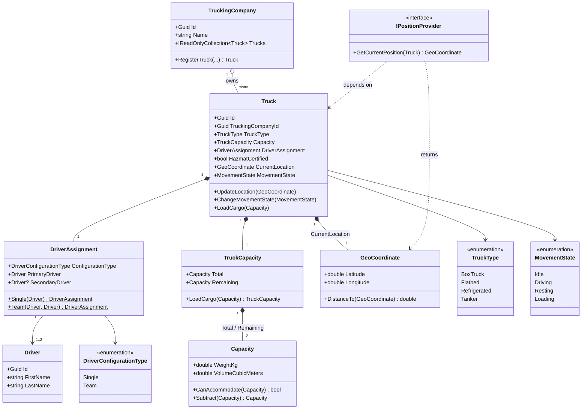

# Slice 1 — Fleet Domain Model

**Status:** Implemented (`backend/src/Freight.Domain`, `Fleet/` and `ValueObjects/` folders).
**Scope:** FR-2 (Fleet & Company Management) — Truck, Driver, TruckingCompany, driver
configuration, movement state, and the position/distance calculator. Pure domain
model: no persistence, no API endpoints (see [requirements](../../trucking-marketplace-requirements.md),
Section 18).

## Entity/value object diagram

## Notes

- **`Truck` is only constructible via `TruckingCompany.RegisterTruck(...)`** (`Truck`'s
  constructor is `internal`) — enforces FR-2.2 (a truck belongs to exactly one
  company) structurally, not by convention.
- **`DriverAssignment`** is constructed only via `Single(...)`/`Team(...)` factory
  methods — a mismatched state (e.g. `Team` with one driver) is unrepresentable, not
  just rejected by validation.
- **`Truck` never references `Driver` directly** — the only path is
  `Truck → DriverAssignment → Driver`.
- **`TruckCapacity.Total` is fixed at construction and never changes.** Only
  `Remaining` moves, via `LoadCargo(...)`, which cannot reduce it below zero
  (delegates to `Capacity.Subtract`).
- **`GeoCoordinate.DistanceTo` implements haversine straight-line distance.**
  Originally the authoritative distance/time source for pricing and eligibility per
  [ADR 0005](../adr/0005-haversine-distance-no-routing-api.md); that role is now
  superseded by [ADR 0010](../adr/0010-cached-osrm-route-time-supersedes-haversine.md)
  (cached, OSRM-derived route time). `DistanceTo` itself is unchanged and remains a
  useful pure-geometry utility — the pricing/eligibility slices now consume the Slice
  4 Route Time Engine instead of calling this directly for their authoritative numbers.
- **`IPositionProvider`** satisfies the Dependency Inversion requirement in Section
  11.3 — domain code depends on this interface, not a concrete GPS source. No
  implementation exists yet; the real (simulated) implementation lands in Slice 9
  (live tick scheduler).

## Explicitly deferred (not part of this slice)

- EU driving/rest-hour accrual on `Driver` (Slice 2, Section 9)
- Movement-state transition *rules*/guards (Slice 2/9)
- Truck's assigned shipments / cargo destinations (Slice 3, new — see ADR 0010's context)
- Route time calculation combining driver state + travel time (Slice 4, new — Route Time Engine, ADR 0010)
- Cargo-kind → truck-type eligibility matching (Slice 7, Section 8)
- Persistence / EF Core / repositories
- API endpoints
