# Slice 2 — EU Driving & Rest-Rule Engine

**Status:** Implemented (`backend/src/Freight.Domain/Tracking/`, plus `Common/` for
the new domain-event base types).
**Scope:** Section 9 (EU Regulation (EC) 561/2006 — daily/weekly/two-week driving
limits, breaks, daily/weekly rest, team-driving alternation). Pure domain model: no
persistence, no API, no background scheduler — see [requirements](../../trucking-marketplace-requirements.md),
Section 18. The tick loop that calls this engine on a timer (FR-8.1) is Slice 9
(renumbered from Slice 7 when Slices 3-4 were inserted — see ADR 0010).

## Entity/value object diagram

```mermaid
classDiagram
    class DriverComplianceState {
        +Guid DriverId
        +DriverActivity CurrentActivity
        +int MinutesRemainingInCurrentActivity
        +int ContinuousDrivingMinutesSinceBreak
        +bool AwaitingSecondBreakBlock
        +int DailyDrivingMinutesToday
        +int ExtendedDaysUsedThisWeek
        +bool IsTodayExtended
        +bool AwaitingSecondDailyRestBlock
        +int ReducedDailyRestsUsedSinceWeeklyRest
        +int WeeklyDrivingMinutesThisWeek
        +int WeeklyDrivingMinutesPriorWeek
        +DateTime LastEvaluatedSimulatedTime
        +Clone()$ DriverComplianceState
    }

    class DriverRulePreference {
        +Guid DriverId
        +BreakPreference BreakPreference
        +DailyRestPreference DailyRestPreference
        +WeeklyRestPreference WeeklyRestPreference
        +bool ExtendDailyDrivingWhenEligible
    }

    class DriverRulePreferenceRegistry {
        +Assign(DriverRulePreference)
        +Get(Guid) DriverRulePreference
        +TryGet(Guid, out DriverRulePreference?) bool
        +IsAssigned(Guid) bool
    }

    DriverRulePreferenceRegistry ..> DriverRulePreference : holds, keyed by DriverId

    class RestRuleLimits {
        +int MaxContinuousDrivingMinutesBeforeBreak
        +int RequiredBreakMinutes
        +int MaxDailyDrivingMinutes
        +int ExtendedDailyDrivingMinutes
        +int MaxWeeklyDrivingMinutes
        +int MaxTwoWeekDrivingMinutes
        +int FullDailyRestMinutes
        +int FullWeeklyRestMinutes
        ...
        +Default$ RestRuleLimits
    }

    class IRestRuleEngine {
        <<interface>>
        +IsEligibleToDriveNow(DriverComplianceState, RestRuleLimits) DriverEligibility
        +IsEligibleToDriveFuture(DriverComplianceState, DriverRulePreference, int, RestRuleLimits) DriverEligibility
        +Advance(DriverComplianceState, TimeSpan, DateTime, DriverRulePreference, RestRuleLimits) RestRuleOutcome
        +EvaluateTeam(...) TeamRestRuleOutcome
        +EvaluateTeamFuture(...) TeamFutureEligibility
    }

    class RestRuleEngine {
        +IsEligibleToDriveNow(DriverComplianceState, RestRuleLimits) DriverEligibility
        +IsEligibleToDriveFuture(DriverComplianceState, DriverRulePreference, int, RestRuleLimits) DriverEligibility
        +Advance(DriverComplianceState, TimeSpan, DateTime, DriverRulePreference, RestRuleLimits) RestRuleOutcome
        +EvaluateTeam(...) TeamRestRuleOutcome
        +EvaluateTeamFuture(...) TeamFutureEligibility
    }

    RestRuleEngine ..|> IRestRuleEngine

    class DriverEligibility {
        +bool IsEligible
        +IneligibilityReason? Reason
        +int? MinutesUntilEligible
    }

    class RestRuleOutcome {
        +DriverComplianceState UpdatedLedger
        +DriverActivity Action
        +IReadOnlyCollection~IDomainEvent~ Events
        +bool WasPolicyOverridden
    }

    class TeamRestRuleOutcome {
        +DriverComplianceState UpdatedPrimaryLedger
        +DriverComplianceState UpdatedSecondaryLedger
        +Guid ActiveDriverId
        +MovementState ResultingMovementState
        +IReadOnlyCollection~IDomainEvent~ Events
        +bool PrimaryWasPolicyOverridden
        +bool SecondaryWasPolicyOverridden
    }

    class TeamFutureEligibility {
        +MovementState ResultingMovementState
        +Guid ActiveDriverId
    }

    class Entity {
        <<abstract>>
        +IReadOnlyCollection~IDomainEvent~ DomainEvents
        #AddDomainEvent(IDomainEvent)
        +ClearDomainEvents()
    }

    class IDomainEvent {
        <<interface>>
        +DateTime OccurredAt
    }

    DriverComplianceState --|> Entity
    RestRuleEngine ..> DriverComplianceState : advances
    RestRuleEngine ..> DriverRulePreference : consults
    RestRuleEngine ..> RestRuleLimits : consults
    RestRuleEngine ..> DriverEligibility : returns
    RestRuleEngine ..> RestRuleOutcome : returns
    RestRuleEngine ..> TeamRestRuleOutcome : returns
    TeamRestRuleOutcome ..> DriverComplianceState
    IDomainEvent <|.. TruckTookBreak
    IDomainEvent <|.. TruckWentIntoRest
    IDomainEvent <|.. TruckResumedDriving
    IDomainEvent <|.. TruckArrivedAtDestination
```

## Notes

- **`RestRuleEngine` is a stateless class behind `IRestRuleEngine`** (`Tracking/Abstractions/`),
  not entity methods and not a static class — every rule decision is multi-factor
  arbitration over accumulated ledger history (unlike `Truck`'s simple single-fact
  mutations in Slice 1), so it's kept in one reviewable, directly-testable place.
  Matches the DIP convention already established by `IPositionProvider` (Fleet
  context, Slice 1): domain/application code depends on the interface, injected via
  DI (constructed as `new RestRuleEngine()` behind `IRestRuleEngine` at call sites,
  e.g. in tests), so a test double can be substituted without touching consumers, and
  the real implementation stays swappable. Five entry points:
  - `IsEligibleToDriveNow(ledger, limits)` — pure, non-mutating query: "can this
    driver drive right now, and if not, why / for how much longer." Deliberately
    takes **no time parameter and no preference** — eligibility right now is fully
    determined by the ledger's own stored state plus the regulatory limits; nothing
    else is needed, and no unused parameter pretends otherwise.
  - `IsEligibleToDriveFuture(ledger, preference, afterMinutes, limits)` — "will this
    driver be eligible `afterMinutes` of simulated time from now?" Since a driver's
    future is fully determined by their fixed `preference` (nothing in this
    simulation can interrupt a plan once started — see Section 9.3/dummy-driver
    discussion), this is a deterministic replay, not an estimate: it clones the
    ledger (`DriverComplianceState.Clone()`, an `internal` value-copy — every field
    is a value type, so this is a complete copy), advances the copy forward via the
    same internal `AdvanceCore` used by `Advance`, and reports
    `IsEligibleToDriveNow` on the result. The real ledger is never touched.
    **Important:** `afterMinutes` is *elapsed simulated time*, not *driving time* —
    a mandatory break consumes elapsed time without accruing driving minutes, so
    "540 minutes from now" is not the same as "540 minutes driven."
  - `Advance` — single-driver tick: drives if eligible, begins/continues the
    required stop otherwise. Called once per tick by the caller (Slice 9).
  - `EvaluateTeam` — two-ledger tick for `Team`-assignment trucks; implements the
    primary-first swap rule (see below) and returns the resulting truck
    `MovementState`. Uses `IsEligibleToDriveNow` throughout — team correctness
    depends on the same single eligibility check as the single-driver path, not a
    separate implementation.
  - `EvaluateTeamFuture(primaryLedger, secondaryLedger, currentlyActiveDriverId,
    afterMinutes, primaryPreference, secondaryPreference, limits)` — the team
    equivalent of `IsEligibleToDriveFuture`: what would the truck's
    `MovementState` and active driver be `afterMinutes` from now? **Cannot simply
    delegate to one `EvaluateTeam` call with the full duration** — `EvaluateTeam`
    only re-evaluates the swap decision once per call, at its start, then hands the
    entire elapsed duration to whichever driver was already active. A projection
    spanning multiple boundary crossings (e.g. primary hits their daily cap, swaps
    to secondary, secondary later hits their own weekly cap — the worked example)
    needs a fresh swap check at *each* crossing. This was caught by a test that
    cross-checked a one-shot projection against the same scenario walked forward
    tick-by-tick via `EvaluateTeam` — they disagreed, confirming the one-shot
    version was wrong, not just imprecise. Fixed by looping `EvaluateTeam` in
    1-minute steps internally (mirroring the granularity the tests already use for
    exact boundary landings), operating on cloned ledgers throughout — real ledgers
    are never touched, same guarantee as the single-driver version.
- **Assigning a preference to a driver: `DriverRulePreferenceRegistry`.** A small
  in-memory registry (`Assign`, `Get`, `TryGet`, `IsAssigned`), keyed by `DriverId`,
  backed by a `Dictionary<Guid, DriverRulePreference>`. This is the actual mechanism
  for "which rules does driver X follow" — `DriverRulePreference` alone is just a
  value object; nothing durably links it to a driver without going through the
  registry. No persistence yet (consistent with the rest of Slice 2 being pure
  domain, no DB) — callers (tests today, Slice 9 later) `Assign` once per driver at
  simulation setup, then `Get` it back by `DriverId` wherever needed rather than
  constructing/passing preferences ad hoc.
- **"Daily" and "weekly" are rest-bounded, not calendar-bounded.** A driver's "day"
  resets when their own qualifying daily rest completes; their "week" resets when
  their own qualifying weekly rest completes. There is no shared global day/week
  boundary — two drivers' clocks can be arbitrarily offset from each other. This
  matches the actual text of EC 561/2006, not a midnight/Monday convention.
- **Tick-boundary precision.** A regulatory limit can be crossed mid-tick (e.g. a
  10-minute tick where only 4 minutes are legally drivable before the daily cap).
  `Advance`/`EvaluateTeam` clamp accrual to exactly the drivable portion of the tick
  (`MinutesUntilNextBoundary`) rather than overshooting by up to a full tick — the
  leftover tick time is then spent on whatever stop begins. The reverse case (a
  rest/break completing mid-tick, with leftover minutes owed to driving) is handled
  the same way, routed back through the same clamped-accrual path rather than
  crediting the overrun unconditionally.
- **Team alternation is a hard-gate-driven swap, not a heuristic.** `IsEligibleToDriveNow`
  is the single hard gate (daily cap, weekly cap, two-week cap, not mid-required-rest)
  used on both drivers. The primary drives by default and keeps driving through their
  own 4.5h breaks (a break is explicitly *not* a swap trigger — tracked on the active
  driver's own ledger only, per Section 9.3). A swap to the other driver happens only
  when the active driver's hard gate fails for a real capacity reason (daily/weekly/
  two-week) and the other driver currently passes the gate. There is no swap-back on
  recovery — once switched, the new active driver keeps driving until *their own* gate
  fails. Both simultaneously failing → truck → `Resting`. An inactive, still-eligible
  driver is left untouched each tick (not forced into an unneeded rest) — they simply
  wait to become active.
- **Split break/rest sequencing** (`AwaitingSecondBreakBlock` /
  `AwaitingSecondDailyRestBlock`) is tracked as explicit ledger flags set by whichever
  method completes the first block, not inferred from banked-minutes values doing
  double duty — avoids the block-sequencing ambiguity that a single "banked minutes"
  field would introduce.
- **Extension-to-10h is a one-time-per-day decision** (`DecideDailyExtension`),
  made the instant a driver's daily total first reaches the 9h mark, consulting both
  their `ExtendDailyDrivingWhenEligible` preference and the remaining weekly quota.
  Recorded on `IsTodayExtended` so later eligibility checks don't need `preference`
  (which `IsEligibleToDriveNow` deliberately doesn't take, keeping it a pure state
  query — `IsEligibleToDriveFuture` is the one entry point that does take it, since
  projecting forward requires knowing which choices the driver's plan would make).
- **A driver's stated preference is always subordinate to legality.** When a
  preferred option isn't legally available (e.g. reduced-rest quota exhausted), the
  engine substitutes the closest legal option and reports `WasPolicyOverridden = true`
  (per-driver on `TeamRestRuleOutcome`) rather than either violating the regulation or
  silently ignoring the driver's plan.
- **Domain event infrastructure is new, greenfield** (`Freight.Domain/Common/`):
  `IDomainEvent` (marker + `OccurredAt`) and `Entity` (thin base class holding a
  `DomainEvents` collection). `DriverComplianceState` is the first entity to use it.
  Events are recorded on entities but not dispatched — publishing them is Slice 9's
  event-backbone concern.
- **No history is stored** — `DriverComplianceState` is a rolling-balance ledger only.
  "When was this driver working vs. resting" is reconstructed from the domain events
  (`TruckTookBreak`, `TruckWentIntoRest`, `TruckResumedDriving`,
  `TruckArrivedAtDestination`) rather than duplicated in the ledger.
- **Reduced-weekly-rest compensation tracking was built, then removed (resolved
  during review).** Section 9.2's reduced-weekly-rest rule requires the missing rest
  to be paid back on a later rest period within three weeks. An earlier pass added
  `CompensationMinutesOwed`/`CompensationDueBySimulatedDate` fields (set when a
  reduced weekly rest began) and an `IsCurrentWeeklyRestReduced` flag, but nothing
  ever *read* them back — no later rest was actually extended to repay the debt, no
  deadline was checked. Recording an obligation without enforcing it looks
  implemented but silently does nothing, which is worse than not having it, so all
  three were removed rather than left half-built. If compensation enforcement is
  wanted later, it needs to be built as a real feature (a later `BeginWeeklyRest`
  call consulting an owed-minutes balance and extending that rest, plus a deadline
  check) — not scope creep to reintroduce now.
- **`RestRuleLimits` is a POCO, not hardcoded constants.** `RestRuleLimits.Default`
  holds the EU-561/2006 values for tests/until a real loader exists. A DB-backed
  loader (one table, one row, editable without redeploy) is deferred to whichever
  slice introduces EF Core/Infrastructure persistence.
- **`InternalsVisibleTo`** (`Freight.Domain.csproj`) grants `Freight.Domain.Tests`
  access to the ledger's `internal set` properties, so tests can seed arbitrary
  starting states (e.g. "54h already logged this week") directly, without needing
  a public mutation API that production callers shouldn't have.

## Explicitly deferred (not part of this slice)

- Background tick scheduler / "fast-forward N hours" demo control (Slice 9)
- Reduced-weekly-rest compensation enforcement (see note above) — the concept was
  considered and explicitly dropped as half-built, not merely unscheduled
- `RestRuleLimits` DB-backed loader (Infrastructure layer, later)
- Domain event *dispatching* — entities record events; publishing to subscribers is
  Slice 9's event backbone
- Wiring `Truck.ChangeMovementState` from `EvaluateTeam`'s `ResultingMovementState` —
  this slice produces the *decision*, Slice 9 applies it
- Truck's assigned shipments / cargo destinations (Slice 3, new)
- Route time calculation combining this engine's driver-state output with travel
  time (Slice 4, new — Route Time Engine, see ADR 0010)
- `MovementState.Loading` — untouched by this engine. Phase 1 assumption:
  zero-duration, no accrual. Phase 2 (unscheduled): real loading duration and the
  separate EU Working Time Directive (2002/15/EC) — see
  [ADR 0009](../adr/0009-loading-time-and-working-time-directive-deferred.md) and
  Section 19 of the [requirements doc](../../trucking-marketplace-requirements.md).
