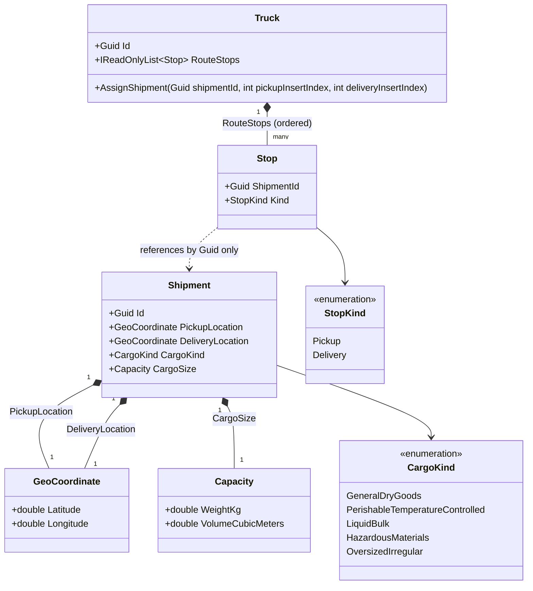

# Slice 3 — Minimal Shipment

**Status:** Implemented (`backend/src/Freight.Domain`, `Shipment/` folder; `Fleet/Truck.cs`
extended).
**Scope:** A minimal `Shipment` aggregate (id, pickup/delivery location, cargo kind,
weight/volume — no state machine, shipper, or deadline yet) and `Truck.AssignedShipmentIds`
(ordered, multiple shipments per truck). Inserted between Slices 1-2 and the rest of the
roadmap per [ADR 0010](../adr/0010-cached-osrm-route-time-supersedes-haversine.md): Slices
1-2 predate the need for a truck's assigned cargo and shipment locations, which Slice 4
(Route Time Engine) consumes. See [requirements](../../trucking-marketplace-requirements.md),
Section 18.

## Entity/value object diagram

The dotted arrow from `Stop` to `Shipment` is deliberate: a `Stop` carries only
`ShipmentId` (`Guid`) and `StopKind`, not a `Shipment` reference — there is no UML
composition or association to an actual `Shipment` object. `Fleet` and `Shipment` remain
decoupled at the code level, not just the data level (`Truck.cs`/`Stop.cs` do not
reference the `Shipment` type at all).

## Notes

- **No state machine, shipper reference, or deadline** — deliberately deferred to Slice 8,
  which richens this same `Shipment` skeleton once the shipper facet and bidding flow are
  in scope. This slice only needs enough data for Slice 4 (route time) and Slice 9
  (eligibility) to consume.
- **Cargo kind and weight/volume are included this early** because Slice 9 (eligibility)
  needs them for cargo-compatibility and capacity filtering, and neither has any
  dependency on the state-machine/shipper pieces that *are* deferred.
- **`CargoKind` is a plain enum** with five values mapped 1:1 to the Section 8.1 taxonomy
  rows — mirrors `TruckType`/`MovementState`'s existing convention (no smart-enum
  pattern). The cargo-kind → truck-type *mapping* itself is Slice 9's job, not this
  slice's; Slice 3 only carries the kind as data.
- **`Shipment.CargoSize` reuses the existing `Capacity` value object** (`WeightKg`,
  `VolumeCubicMeters`) rather than introducing a new type. `Capacity` itself still only
  enforces `>= 0` (correct for `Truck`'s remaining-capacity use case, where zero is
  legitimate). `Shipment`'s constructor layers a stricter check on top, rejecting a
  zero-weight or zero-volume cargo size — a real shipment always has positive weight and
  volume.
- **`Shipment`'s constructor is `public`**, unlike `Truck`'s `internal` one. No aggregate
  yet owns `Shipment`'s construction (the shipper doesn't exist until Slice 8), so there
  is nothing to route construction through.
- **`Shipment` uses plain reference equality** (no `Equals`/`GetHashCode` override) —
  consistent with `Truck` and `TruckingCompany`, which are entities identified by `Id`,
  not structural value.
- **`Truck.RouteStops` is `List<Stop>`, where `Stop` carries only `ShipmentId: Guid` and
  `StopKind`, not a `Shipment` reference.** `Truck` already references its own parent
  (`TruckingCompany`) by `Guid` (`TruckingCompanyId`), not by holding a `TruckingCompany`
  object — this mirrors that existing convention symmetrically for children. It also
  anticipates `Shipment` becoming its own aggregate root with its own consistency
  boundary in Slice 8; a direct object reference would couple `Truck`'s and `Shipment`'s
  lifecycles once persistence arrives (an EF Core navigation property would cascade
  loads/saves across what should be two independent aggregates).
- **A shipment contributes two independent stops to the route — a `Pickup` and a
  `Delivery` — and they are not necessarily adjacent.** Other shipments' stops can be
  interleaved between them (e.g. pick up shipment B somewhere between shipment A's pickup
  and delivery). This reflects a real dispatch scenario: a truck already routed through
  several shipments can have a new shipment's pickup and delivery each inserted at
  different points along that existing route, not bolted on as a pair at one spot.
- **`AssignShipment(shipmentId, pickupInsertIndex, deliveryInsertIndex)` takes two
  independent insertion positions, both expressed as indices into the route *as it
  exists before the call*.** The caller (ultimately the dispatcher, per Slice 12) does
  not need to account for index drift caused by inserting the pickup stop before the
  delivery stop — `AssignShipment` shifts the delivery index internally. The only
  structural rule enforced here is causality: `deliveryInsertIndex` must be at least
  `pickupInsertIndex` in the pre-insertion route (equal means "insert delivery
  immediately after pickup, with no other stop in between"), or the call throws
  `ArgumentException` and the route is left unchanged. This is basic sanity (a shipment
  cannot be delivered before it is picked up), not the full route-feasibility
  computation — whether the *resulting* route is still legally/logically achievable
  end-to-end is Slice 9's job.
- **No other validation** — no capacity check, no duplicate-shipment check, no cargo-kind
  check. Those remain Slice 9's job (eligibility).
- **Removing a stop once it has actually been completed is explicitly out of scope for
  this slice.** `RouteStops` only ever grows via `AssignShipment`; nothing in `Truck`
  removes a stop. That responsibility belongs to Slice 14 (live tick scheduler), the only
  component that knows a truck has actually reached a given stop — Slice 3 has no notion
  of "in progress" vs. "not yet started" for a stop, since the tick engine doesn't exist
  yet.
- **Shipment pickup/delivery locations are exactly what Slice 4 (Route Time Engine)
  consumes** to query OSRM for a cached, rounded route time — no extra abstraction (e.g.
  an `IHasRoute` interface) is introduced in this slice; `PickupLocation`/
  `DeliveryLocation` are plain public `GeoCoordinate` properties, and Slice 4 reads them
  directly.

## Explicitly deferred (not part of this slice)

- Shipment state machine (`Open → Bidding → Awarded / Unfulfilled`) (Slice 8)
- Shipper reference and delivery deadline (Slice 8)
- Cargo-kind → truck-type eligibility matching (Slice 9, Section 8)
- Capacity/duplicate/cargo-kind validation on `Truck.AssignShipment` (Slice 9)
- Whole-route feasibility validation after a stop insertion — whether the resulting
  route can still legally meet every shipment's deadline (Slice 9, Section 8.4)
- Stop completion / removal from `RouteStops` once a truck actually reaches a stop
  (Slice 14, live tick scheduler)
- Route time calculation combining driver state + travel time (Slice 4, Route Time
  Engine, ADR 0010)
- Persistence / EF Core mapping / repositories for `Shipment` — deferred at the
  time this slice was built; the minimal `FreightDbContext` skeleton now exists
  (`Freight.Infrastructure/Persistence/`, no entity mappings yet), and EF Core
  configuration for `Shipment` is picked up retroactively or by whichever later
  slice first needs it to survive past a single test run — persistence is added
  incrementally, one slice's aggregate(s) at a time (see Section 18)
- API endpoints
