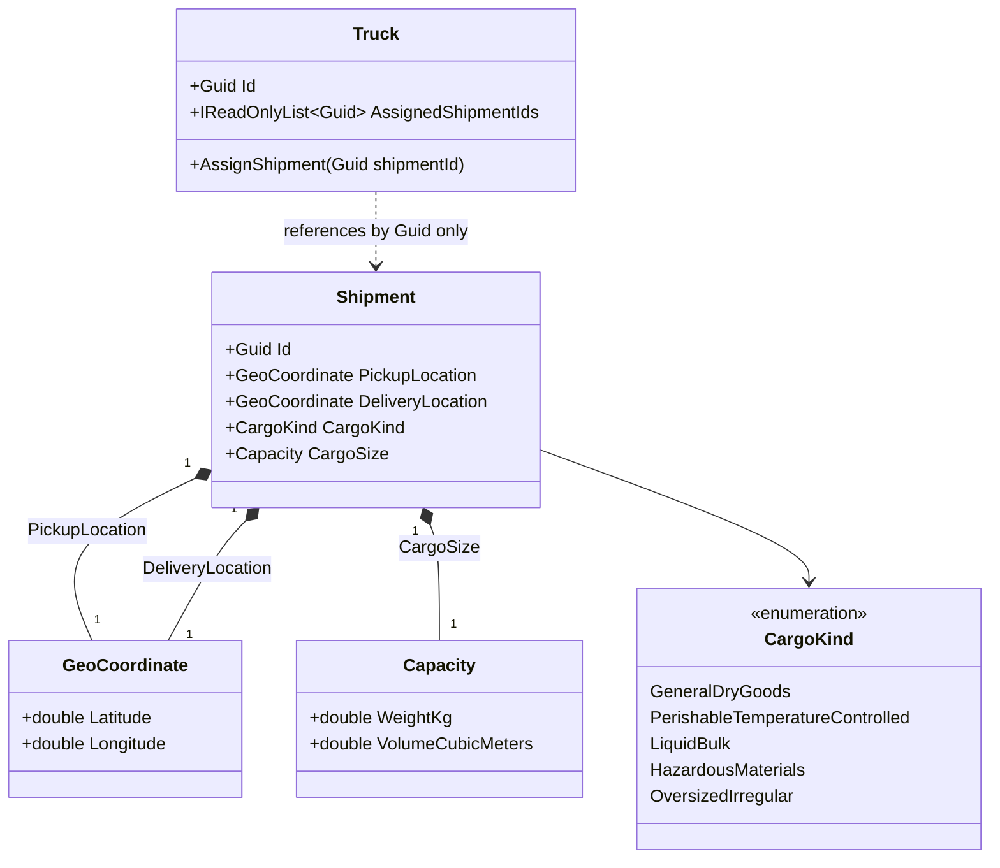

# Slice 3 — Minimal Shipment

**Status:** Implemented (`backend/src/Freight.Domain`, `Shipment/` folder; `Fleet/Truck.cs`
extended).
**Scope:** A minimal `Shipment` aggregate (id, pickup/delivery location, cargo kind,
weight/volume — no state machine, shipper, or deadline yet) and `Truck.AssignedShipmentIds`
(ordered, multiple shipments per truck). Inserted between Slices 1-2 and the rest of the
roadmap per [ADR 0010](../adr/0010-cached-osrm-route-time-supersedes-haversine.md): Slices
1-2 predate the need for a truck's assigned cargo and shipment locations, which Slice 4
(Route Time Engine) consumes. See [requirements](../../trucking-marketplace-requirements.md),
Section 18.

## Entity/value object diagram

The dotted arrow from `Truck` to `Shipment` is deliberate: `Truck` holds
`AssignedShipmentIds` as `List<Guid>`, not `List<Shipment>` — there is no UML composition
or association to an actual `Shipment` object. `Fleet` and `Shipment` remain decoupled at
the code level, not just the data level (`Truck.cs` does not reference the `Shipment`
type at all).

## Notes

- **No state machine, shipper reference, or deadline** — deliberately deferred to Slice 8,
  which richens this same `Shipment` skeleton once the shipper facet and bidding flow are
  in scope. This slice only needs enough data for Slice 4 (route time) and Slice 9
  (eligibility) to consume.
- **Cargo kind and weight/volume are included this early** because Slice 9 (eligibility)
  needs them for cargo-compatibility and capacity filtering, and neither has any
  dependency on the state-machine/shipper pieces that *are* deferred.
- **`CargoKind` is a plain enum** with five values mapped 1:1 to the Section 8.1 taxonomy
  rows — mirrors `TruckType`/`MovementState`'s existing convention (no smart-enum
  pattern). The cargo-kind → truck-type *mapping* itself is Slice 9's job, not this
  slice's; Slice 3 only carries the kind as data.
- **`Shipment.CargoSize` reuses the existing `Capacity` value object** (`WeightKg`,
  `VolumeCubicMeters`) rather than introducing a new type. `Capacity` itself still only
  enforces `>= 0` (correct for `Truck`'s remaining-capacity use case, where zero is
  legitimate). `Shipment`'s constructor layers a stricter check on top, rejecting a
  zero-weight or zero-volume cargo size — a real shipment always has positive weight and
  volume.
- **`Shipment`'s constructor is `public`**, unlike `Truck`'s `internal` one. No aggregate
  yet owns `Shipment`'s construction (the shipper doesn't exist until Slice 8), so there
  is nothing to route construction through.
- **`Shipment` uses plain reference equality** (no `Equals`/`GetHashCode` override) —
  consistent with `Truck` and `TruckingCompany`, which are entities identified by `Id`,
  not structural value.
- **`Truck.AssignedShipmentIds` is `List<Guid>`, not `List<Shipment>`.** `Truck` already
  references its own parent (`TruckingCompany`) by `Guid` (`TruckingCompanyId`), not by
  holding a `TruckingCompany` object — this mirrors that existing convention
  symmetrically for children. It also anticipates `Shipment` becoming its own aggregate
  root with its own consistency boundary in Slice 8; a direct object reference would
  couple `Truck`'s and `Shipment`'s lifecycles once persistence arrives (an EF Core
  navigation property would cascade loads/saves across what should be two independent
  aggregates).
- **`Truck.AssignShipment(shipmentId)` performs no validation** beyond rejecting an empty
  `Guid` — no capacity check, no duplicate check, no cargo-kind check. Those are Slice 9's
  job (eligibility); this slice is purely structural — an ordered, appendable list exists.
  Assigning the same shipment id twice is currently permitted and simply appends a
  duplicate entry.
- **Shipment pickup/delivery locations are exactly what Slice 4 (Route Time Engine)
  consumes** to query OSRM for a cached, rounded route time — no extra abstraction (e.g.
  an `IHasRoute` interface) is introduced in this slice; `PickupLocation`/
  `DeliveryLocation` are plain public `GeoCoordinate` properties, and Slice 4 reads them
  directly.

## Explicitly deferred (not part of this slice)

- Shipment state machine (`Open → Bidding → Awarded / Unfulfilled`) (Slice 8)
- Shipper reference and delivery deadline (Slice 8)
- Cargo-kind → truck-type eligibility matching (Slice 9, Section 8)
- Capacity/duplicate/cargo-kind validation on `Truck.AssignShipment` (Slice 9)
- Route time calculation combining driver state + travel time (Slice 4, Route Time
  Engine, ADR 0010)
- Persistence / EF Core mapping / repositories for `Shipment` — deferred at the
  time this slice was built; the minimal `FreightDbContext` skeleton now exists
  (`Freight.Infrastructure/Persistence/`, no entity mappings yet), and EF Core
  configuration for `Shipment` is picked up retroactively or by whichever later
  slice first needs it to survive past a single test run — persistence is added
  incrementally, one slice's aggregate(s) at a time (see Section 18)
- API endpoints
