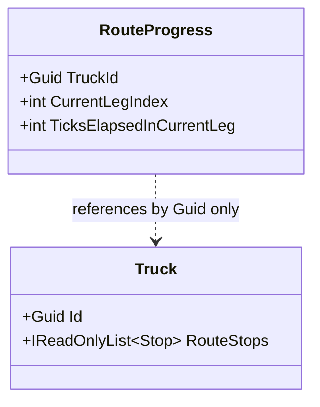

# Slice 4 — Route Time Engine

**Status:** In progress. Only the `RouteProgress` entity (`backend/src/Freight.Domain/Tracking/RouteProgress.cs`)
exists so far — the route-time calculation itself (OSRM integration, tick-by-tick
interleaving with the Slice 2 rest-rule engine) is not yet built. See
[requirements](../../trucking-marketplace-requirements.md), Section 18, and
[ADR 0010](../adr/0010-cached-osrm-route-time-supersedes-haversine.md).

**Scope (full slice, target):** Given a truck's route (`Truck.RouteStops`, Slice 3) and
its drivers' rest-rule ledgers (`DriverComplianceState`, Slice 2), answer "when will
this truck reach stop X" — and the reverse, "how far along its route has it gotten
after N elapsed minutes" — as a real OSRM-derived, 10-minute-grid calculation. Consumed
by Slice 9 (eligibility) and Slice 6 (pricing), which do no calculation of their own —
they read Slice 4's output. No persistence in this slice (Slice 5's job); no rest-rule
logic duplicated here (Slice 2's job, called into).

## Why a new entity was needed

`Truck` (Slice 1/3) tracks `CurrentLocation` and `MovementState`, but nothing about
*which leg* of its `RouteStops` sequence it is currently traveling, or how much
progress it has made along that leg. Without that, "where is the truck right now"
cannot be answered from stored state — it would have to be recomputed from the start
of the route on every query, which is not viable once a route has many stops and the
truck has been moving for a while.

`RouteProgress` fills that gap: a small tracking-context entity recording a truck's
current leg and its 10-minute-tick progress within that leg.

## Entity diagram (current state)

## Notes

- **`RouteProgress` lives in `Freight.Domain/Tracking`**, the same bounded context as
  `DriverComplianceState` — both are tick-driven, eventually-consistent tracking state
  per the requirements doc's Section 12.1 bounded-context table, not part of the
  strongly-consistent Fleet or Shipment contexts.
- **References `Truck` by `Guid TruckId` only**, not an object reference — same
  decoupling convention used throughout (`Truck.TruckingCompanyId`, `Stop.ShipmentId`,
  `DriverComplianceState.DriverId`).
- **`CurrentLegIndex`** identifies which leg of `Truck.RouteStops` the truck is
  currently traveling: the gap between stop `CurrentLegIndex - 1` and stop
  `CurrentLegIndex`. `0` means "traveling from its current/start position toward the
  first stop in the route."
- **`TicksElapsedInCurrentLeg`** counts whole completed 10-minute ticks within the
  current leg — the grid the entire engine operates on (see "10-minute grid" below).
  Both fields default to `0` (a truck that hasn't started its route yet, or has no
  route).
- **No mutation methods yet.** Advancing `CurrentLegIndex`/`TicksElapsedInCurrentLeg`
  is the calculation logic that comes next, not part of this step — mirrors how
  `DriverComplianceState` was introduced as a ledger shape in Slice 2 before
  `RestRuleEngine`'s mutation logic existed.
- **Per-driver ledger state is not duplicated here.** `DriverComplianceState` already
  exists per driver (Slice 2, keyed by `DriverId`). The calculation logic reaches a
  truck's drivers via `Truck.DriverAssignment` and looks up each one's existing ledger
  separately; `RouteProgress` does not hold a copy or reference to it.

## The 10-minute grid (design decisions made, not yet implemented)

Established through design discussion, to guide the calculation logic when it's built:

- **Every quantity in this engine is a multiple of 10 minutes.** There is no 1-minute
  or fractional-tick value anywhere in Slice 4's calculations — this matches FR-8.1's
  10-simulated-minute tick and keeps Slice 4 precomputing on the same grid the live
  tick scheduler (Slice 14) will later step through.
- **Leg durations round up.** An OSRM duration response is snapped onto the 10-minute
  grid by rounding up (per ADR 0010) the moment it's received — never carried around
  as a precise, off-grid value.
- **Progress queries round down (floor).** "How far along by elapsed time T" answers
  as of the last *completed* 10-minute tick, never mid-tick — e.g. a query at 1h09m
  answers as of 1h00m, same as a query at 1h02m.
- **Elapsed-time-fraction stands in for distance-fraction.** E.g. 20% of a leg's
  (rest-rule-adjusted) driving time elapsed is treated as 20% of that leg's distance
  covered. This is a deliberate approximation, not literal physics.
- **Driving time and elapsed time are not the same.** Mandatory breaks/rest (Slice 2)
  consume elapsed time without covering distance. "When will it reach stop X" has to
  interleave OSRM leg durations with `IRestRuleEngine` boundary-by-boundary — including
  team-truck driver swaps — not just sum leg durations against a clock.
- **Re-routing mid-leg reuses the same calculation.** If the target stop changes
  partway through a leg, the truck's current coordinate is found by asking OSRM for
  the point at the elapsed-fraction along the *real road geometry* (not a straight-line/
  haversine interpolation) from the leg's origin toward its original destination; that
  becomes the new origin for a fresh OSRM query to the new target. This is not a
  separate method — the same "when will it reach stop Y" calculation, called again.
- **Dead time (mandatory rest/breaks) is included in the answer, not surfaced
  separately.** "When will it reach stop X" already accounts for any rest stops needed
  along the way — the caller gets a single arrival time/tick count, not a raw driving
  duration plus a separate rest-time figure to add themselves.

## Explicitly deferred (not part of this step)

- The route-time calculation itself: OSRM duration queries, OSRM geometry/waypoint
  queries for mid-leg re-routing, and the tick-by-tick interleaving with
  `IRestRuleEngine`/`EvaluateTeamFuture` described above
- Methods to advance or query `RouteProgress` (still just a data shape at this point)
- OSRM HTTP client (`Freight.Infrastructure`) and the `IRouteTimeProvider`-style
  abstraction it sits behind (mirrors `IPositionProvider`, Slice 1)
- OSRM-unreachable fallback/retry strategy (explicitly deferred per ADR 0010's own
  text — decided when the calculation logic is built)
- Persistence / EF Core mapping for `RouteProgress` — Slice 5's job, same as the rest
  of Slices 1-4's aggregates
- API endpoints
