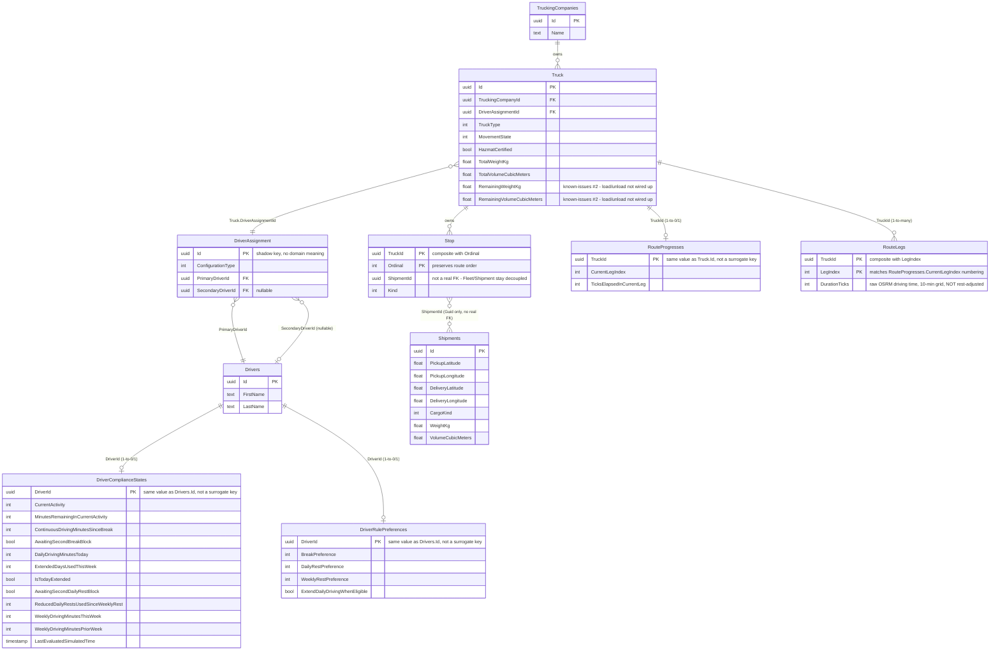

# Slice 5 — Complete Database Diagram (Proposed)

**Status:** Proposed schema for review — **nothing in this diagram has been applied
to a database.** Six tables have each been individually spiked against a real
Postgres container to confirm EF Core could map them (`TruckingCompanies`, `Truck`,
`DriverAssignment`, `Drivers`, `Stop`, `DriverRulePreferences` — see
[slice-5-persistence.md](slice-5-persistence.md) and `known-issues.md` issue #3 for
what those spikes found); the database is deleted between each spike, per the
review-before-migrate process. `Shipments`, `DriverComplianceStates`,
`RouteProgresses`, and `RouteLegs` are proposed mappings only, not yet attempted.

**This diagram has been superseded in three places by findings from schema
review — see `../known-issues.md` for the full detail:**
- `Truck.CurrentLocation` (`CurrentLatitude`/`CurrentLongitude` below) is planned for
  **removal** — issue #1. Position should be derived from `RouteProgresses` +
  `RouteLegs` + the route-time engine, not stored and rewritten every tick.
- `Truck`'s `Remaining*` capacity fields have a real bug — issue #2 — nothing
  currently reduces them on pickup or restores them on delivery.
- `RouteLegs` is new, added during review — issue #4 — to hold the OSRM-derived
  driving duration per leg, which nothing previously stored at all.

This covers persistence for the aggregates built in Slices 1-4. It does not cover
Shipment's state machine/shipper/deadline fields, Bid, or anything from Slice 6
onward — those don't exist in the domain model yet.

## Full schema

## Table-by-table: what it is and why it looks like this

| Table | Real/independent or owned? | Why |
|---|---|---|
| `TruckingCompanies` | Real, independent — **verified** | Aggregate root — the only Fleet entry point queried directly. |
| `Truck` | Owned by `TruckingCompanies` — **verified** | Never queried on its own; only reachable through a company's `Trucks` collection. Still gets a real row/table because EF owned *collections* (as opposed to a single owned value) always require one. `CurrentLocation` removed from this table per known-issues #1 — position is derived, not stored. |
| `DriverAssignment` | Real, independent (promoted) — **verified** | Domain-designed with **no identity** (`Single`/`Team` factories only) — would ideally be an inline value on `Truck`, but EF Core cannot construct it that way because two of its three fields reference the independent `Driver` entity. Promoted to its own table purely to satisfy that constraint; the `Id` column has no domain meaning. |
| `Drivers` | Real, independent — **verified** | Drivers have real identity and are referenced (by `DriverAssignment`, and by two Tracking tables), not duplicated. |
| `Stop` | Owned by `Truck` — **verified** | One shipment contributes two stops (pickup + delivery) to a truck's route; order matters, hence the composite `(TruckId, Ordinal)` key. `ShipmentId` is a bare `Guid` column, **not** a foreign key — Slice 3's design deliberately keeps Fleet and Shipment decoupled at the code and data level. |
| `DriverRulePreferences` | Real, independent — **verified** | One row per `Driver`, plain scalar fields, no complications — the simplest table in the whole model. `DriverId` FK to `Drivers.Id` is `ON DELETE CASCADE`. |
| `Shipments` | Real, independent — **proposed, not yet built** | Its own aggregate root (Slice 3), currently just id/pickup/delivery/cargo — no state machine, shipper, or deadline yet (those arrive in Slice 8). `PickupLocation`/`DeliveryLocation`/`CargoSize` are owned value objects, inlined as columns. |
| `DriverComplianceStates` | Real, independent — **proposed, not yet built** | One row per `Driver`. `DriverId` is the primary key directly (no separate surrogate id) since it's a 1-to-1 ledger keyed on the driver it tracks. Inherits from the domain's `Entity` base class, which carries an in-memory-only `DomainEvents` collection that must be explicitly excluded from mapping — it is not a column. |
| `RouteProgresses` | Real, independent — **proposed, not yet built** | Same pattern as `DriverComplianceStates`: one row per `Truck`, `TruckId` is the primary key directly. |
| `RouteLegs` | Real, independent — **new, proposed, not yet built** | One row per leg of a truck's route (composite `TruckId`, `LegIndex`), holding the raw OSRM-derived driving duration for that leg — not rest-adjusted. Added during schema review (known-issues #4) because nothing previously stored a leg's expected duration at all; a separate table rather than a field on `RouteProgresses` so a route's leg durations can be computed up front and survive the truck advancing past earlier legs, which whole-route feasibility checks and mid-route shipment insertion both need. |

## Explicitly not a table

- **`RestRuleLimits`** — pure `init`-only configuration record (EU-561/2006 numeric
  limits) with a `static Default`, no identity, used only as a method parameter into
  the rest-rule engine. A DB-backed loader is a distinct, undesigned feature, not part
  of this slice.
- **`DriverRulePreferenceRegistry`** — a pure in-memory `Dictionary`-backed lookup,
  never persisted itself. A future slice may add a repository that queries
  `DriverRulePreferences` and populates a registry instance at runtime.
- **`Capacity` / `GeoCoordinate` / `TruckCapacity`** — owned value objects, inlined as
  plain columns on their owner (`Truck`, `Shipments`), not separate tables.

## What still needs your review

Six tables (`TruckingCompanies`, `Truck`, `DriverAssignment`, `Drivers`, `Stop`,
`DriverRulePreferences`) have been individually spiked and verified against a real
Postgres container. Four remain proposed only (`Shipments`, `DriverComplianceStates`,
`RouteProgresses`, `RouteLegs`). Before any of these four are turned into a real
migration:

1. Confirm the `RouteLegs` design (Section above, known-issues #4) is right —
   specifically, storing pure OSRM driving duration and computing distance-fraction
   live via the rest-rule engine, rather than pre-inflating the stored duration.
2. Confirm `Shipments`, `DriverComplianceStates`, and `RouteProgresses` (unchanged
   from the original proposal) still look right before spiking them.
3. `Truck.CurrentLocation`'s removal (known-issues #1) and the `Remaining*` capacity
   fix (known-issues #2) are domain-model changes, not just persistence — they need
   to land in `Truck.cs`/`Capacity.cs` before or alongside the next spike that touches
   `Truck`.
