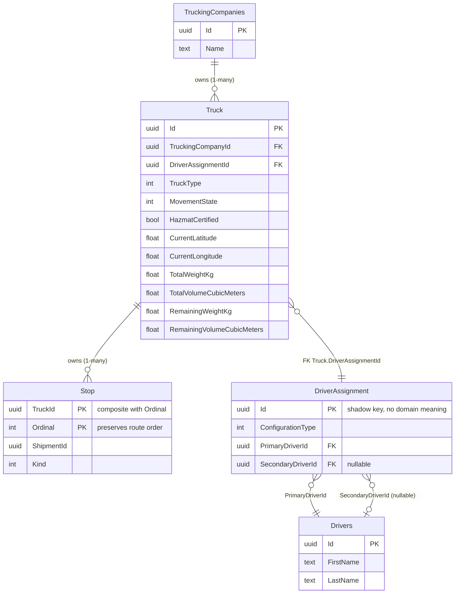

# Slice 5 — EF Core Persistence + PostgreSQL/Docker

**Status:** In progress, paused for process correction. Docker/Postgres was stood up
and the SQL Server → Npgsql switch was done; the highest-risk mapping
(`TruckingCompany` → `Truck` → `DriverAssignment` → `Driver`) was spiked and verified
against a real, applied migration. See [requirements](../../trucking-marketplace-requirements.md),
Section 18, and the Slice 5 planning discussion for the full sequencing.

## Process mistake made while building this slice

The spike (Docker container, package swap, entity configuration, migration
generation, applying it to a live database) was executed straight through, end to
end, without ever pausing to show the resulting schema to the user first. A plan had
already been reviewed and approved before implementation started, but that approval
covered the *approach* — it was not, and should not have been treated as, a license
to run every subsequent step (including a real migration against a real database)
without a checkpoint. The user had to stop the work and explicitly ask for a schema
diagram after the fact, which is the wrong order: the diagram should have been
produced and reviewed *before* the migration was generated and applied, not after.

Consequence: the user directed that the entire database (container and data volume)
be deleted rather than continue from an already-applied, only-after-the-fact-reviewed
state. This has been done — `docker compose down -v` was run, both the
`freight-postgres` container and the `freight-postgres-data` volume are removed, and
there is currently no database running for this project.

**Corrective action going forward:** any further schema changes in this slice —
including throwaway spikes — get a diagram or equivalent review checkpoint presented
to the user *before* a migration is generated or applied, not after. The code changes
already made to the domain model (parameterless constructors added to `Truck`,
`DriverAssignment`, `TruckCapacity` — see below) and the EF configuration classes
remain in the working tree, uncommitted, for the user to review, revise, or discard
before any of it is re-run.

**Scope:** EF Core persistence for the Slice 1-4 aggregate backlog
(`TruckingCompany`, `Truck`, `Driver`, `DriverAssignment`, `Shipment`,
`DriverComplianceState`, `RouteProgress`, `DriverRulePreference`), switching the
database from the never-used SQL Server scaffold to PostgreSQL via Docker Compose,
and a real applied initial migration. Seed data is explicitly deferred to a separate
follow-up.

## Schema diagram (spike result, verified against Postgres)

This is the table shape EF Core actually generated and applied for the
`TruckingCompany`/`Truck`/`DriverAssignment`/`Driver` slice of the model — the
highest-uncertainty mapping in the whole slice — before the throwaway spike
migration was rolled back. It reflects what was empirically confirmed to work, not
the original sketch.

`Capacity` and `GeoCoordinate` are **not** separate tables — both are owned value
objects inlined as plain columns on `Truck` (`TotalWeightKg`/`RemainingWeightKg`/etc.,
`CurrentLatitude`/`CurrentLongitude`), too small to warrant their own row. `Truck` and
`Stop` are real tables but owned by `TruckingCompanies`/`Truck` respectively — neither
is ever queried independently of its owner.

## Non-obvious mapping decisions

- **Why `DriverAssignment` got its own table.** It was designed with no identity of
  its own — only reachable via `DriverAssignment.Single(driver)` /
  `.Team(first, second)`, never a bare constructor (see
  [Slice 1](slice-1-fleet-domain.md)). EF Core's constructor-binding convention
  rejected mapping it as a pure owned/inline value: two of its three constructor
  parameters are references to `Driver`, an independent entity, and EF's materializer
  can only auto-bind scalar or owned-value parameters through a constructor — never
  references to another entity's row. This was confirmed empirically (tried as an
  owned type first, failed identically whether owned or promoted to independent, until
  the actual root cause — the constructor itself — was fixed), not assumed from
  documentation alone.
- **Why the foreign key sits on `Truck`, not `DriverAssignment`.** The natural
  phrasing — "a `DriverAssignment` belongs to a `Truck`" — would put `TruckId` on the
  `DriverAssignment` row. EF Core rejected that direction: `Truck` is itself *owned*
  by `TruckingCompanies` (via `OwnsMany`), and an owned entity cannot be the principal
  side of an unrelated (non-ownership) relationship. Flipping it —
  `Truck.DriverAssignmentId` referencing `DriverAssignment.Id` — is what actually
  migrated and applied cleanly against Postgres.
- **Small, deliberate domain-model changes required.** `Truck`, `DriverAssignment`,
  and `TruckCapacity` each needed a `private` parameterless constructor added, used
  exclusively by EF Core's reflection-based materializer when reloading a row. No
  public construction path changed — `TruckingCompany.RegisterTruck(...)` and
  `DriverAssignment.Single(...)`/`Team(...)` remain the only ways application code can
  construct these types.
- **`InternalsVisibleTo` was deliberately not extended** to `Freight.Infrastructure`.
  EF Core's materializer invokes non-public constructors and sets private-set/backing
  fields via reflection, bypassing C#'s compile-time accessibility checks entirely —
  so no new assembly needs compile-time access to Domain's internals for persistence
  to work.

## Explicitly deferred (not part of this step)

- Remaining entity configurations: `Shipment`, `DriverComplianceState`,
  `RouteProgress`, `DriverRulePreference`
- The real `InitialCreate` migration (the diagram above reflects a throwaway spike
  migration, generated to validate the mapping approach, then rolled back)
- Round-trip verification test project (`Freight.Infrastructure.Tests`)
- Seed data — planned separately, per the roadmap and an explicit decision to scope it
  as its own follow-up rather than bolt it onto this slice
- DB-backed `RestRuleLimits` loader, `DriverRulePreferenceRegistry` → EF-backed
  repository — both out of scope for this slice (see requirements doc Section 18 and
  [Slice 2](slice-2-rest-rule-engine.md))
